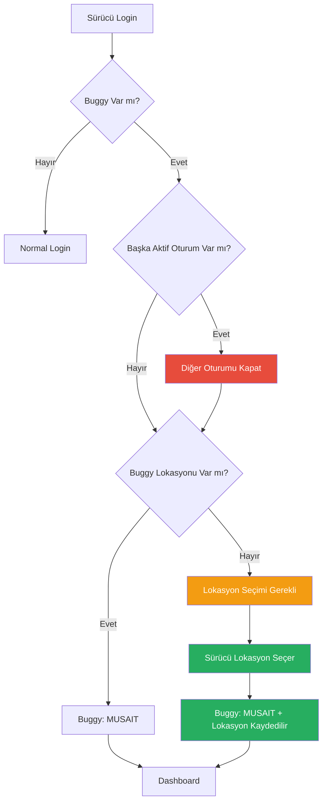

# 🔐 Sürücü Oturum Yönetimi ve Lokasyon Sistemi

## ✅ Uygulanan Özellikler

### 1. Sürücü İlk Giriş Akışı
### 2. Lokasyon Zorunluluğu
### 3. Oturum Yönetimi (3 Kapatma Yöntemi)
### 4. Tek Aktif Oturum Kuralı

---

## 🔄 Sürücü Login Akışı



---

## 📍 Lokasyon Zorunluluğu

### Kural:
> **Buggy MÜSAİT olamaz eğer lokasyonu bilinmiyorsa!**

### Neden?
1. Sürücü sisteme giriş yapar
2. Sistem sürücüye lokasyonunu sorar
3. Sürücü lokasyon seçer
4. Buggy MÜSAİT duruma geçer

### Kod:
```python
# Login sırasında
if user.role == UserRole.DRIVER and user.buggy:
    if not user.buggy.current_location_id:
        session['needs_location_setup'] = True
        # Buggy OFFLINE kalır
    else:
        user.buggy.status = BuggyStatus.AVAILABLE
        # Buggy MÜSAİT olur
```

---

## 🔐 Oturum Kapatma (3 Yöntem)

### Yöntem 1: Sürücü Kendisi Kapatır
```
Sürücü → Çıkış Yap Butonu
           ↓
    Oturum Kapanır
           ↓
    Buggy: OFFLINE
```

**Kod:**
```python
def logout():
    if user.role == UserRole.DRIVER and user.buggy:
        user.buggy.status = BuggyStatus.OFFLINE
    session.clear()
```

### Yöntem 2: Başka Sürücü Aynı Buggy'ye Giriş Yapar
```
Sürücü A Aktif → Sürücü B Login
                      ↓
              Sürücü A Oturumu Kapanır
                      ↓
              Sürücü B Aktif Olur
                      ↓
              Buggy: Sürücü B'ye Ait
```

**Kod:**
```python
# Login sırasında
other_sessions = SessionModel.query.filter(
    SessionModel.user_id != user.id,
    SessionModel.is_active == True
).join(SystemUser).filter(
    SystemUser.buggy_id == user.buggy_id
).all()

for other_session in other_sessions:
    other_session.is_active = False
    other_session.revoked_at = datetime.utcnow()
```

### Yöntem 3: Admin Oturumu Kapatır
```
Admin Panel → Sürücü Listesi → Oturumu Kapat
                                    ↓
                            Oturum Kapanır
                                    ↓
                            Buggy: OFFLINE
```

**Endpoint:**
```http
POST /api/admin/close-driver-session/{driver_id}

Response:
{
  "success": true,
  "message": "Ahmet Yılmaz oturumu kapatıldı"
}
```

---

## 👥 Birden Fazla Sürücü - Tek Aktif Oturum

### Senaryo:
```
BUGGY-01
├─ Sürücü A (Ahmet)
├─ Sürücü B (Mehmet)
└─ Sürücü C (Ali)
```

### Durum 1: Ahmet Aktif
```
Ahmet → Login ✅ (Aktif)
Mehmet → Offline
Ali → Offline

Buggy Durumu: MÜSAİT (Ahmet'in lokasyonunda)
```

### Durum 2: Mehmet Giriş Yapar
```
Ahmet → Oturum Kapandı ❌
Mehmet → Login ✅ (Aktif)
Ali → Offline

Buggy Durumu: 
- Eğer Mehmet lokasyon seçtiyse → MÜSAİT
- Eğer seçmediyse → OFFLINE (lokasyon seçmeli)
```

### Durum 3: Admin Mehmet'i Kapatır
```
Ahmet → Offline
Mehmet → Oturum Kapandı ❌ (Admin tarafından)
Ali → Offline

Buggy Durumu: OFFLINE (Kimse aktif değil)
```

---

## 🆕 Yeni API Endpoint'leri

### 1. İlk Lokasyon Ayarlama
```http
POST /api/driver/set-initial-location

Body:
{
  "location_id": 5
}

Response:
{
  "success": true,
  "message": "Lokasyon ayarlandı, sisteme hoş geldiniz!",
  "buggy": {
    "id": 1,
    "code": "BUGGY-01",
    "status": "available",
    "current_location": {
      "id": 5,
      "name": "Plaj"
    }
  }
}
```

### 2. Admin Oturum Kapatma
```http
POST /api/admin/close-driver-session/{driver_id}

Response:
{
  "success": true,
  "message": "Ahmet Yılmaz oturumu kapatıldı"
}
```

---

## 📊 Oturum Durumları

### Session Model Alanları:
```python
class Session:
    user_id: int
    is_active: bool          # Oturum aktif mi?
    session_token: str
    expires_at: datetime
    last_activity: datetime
    revoked_at: datetime     # Oturum ne zaman kapatıldı?
```

### Oturum Durumu Kontrolü:
```python
# Aktif oturum var mı?
active_session = Session.query.filter_by(
    user_id=driver_id,
    is_active=True
).first()

if active_session:
    print("Sürücü aktif")
else:
    print("Sürücü offline")
```

---

## 🎯 Buggy Durum Geçişleri

### Normal Akış:
```
OFFLINE → (Sürücü Login + Lokasyon Seç) → MÜSAİT
MÜSAİT → (Talep Kabul) → MEŞGUL
MEŞGUL → (İşlem Tamamla) → MÜSAİT
MÜSAİT → (Sürücü Logout) → OFFLINE
```

### Oturum Değişimi:
```
MÜSAİT (Sürücü A) → (Sürücü B Login) → OFFLINE → (Lokasyon Seç) → MÜSAİT (Sürücü B)
```

### Admin Müdahalesi:
```
MÜSAİT (Sürücü A) → (Admin Oturumu Kapat) → OFFLINE
```

---

## 🔐 Güvenlik ve Audit

### Loglanan İşlemler:

1. **İlk Lokasyon Ayarlama**
   ```json
   {
     "action": "driver_initial_location_set",
     "entity_type": "buggy",
     "new_values": {
       "location_id": 5,
       "location_name": "Plaj"
     }
   }
   ```

2. **Admin Oturum Kapatma**
   ```json
   {
     "action": "admin_closed_driver_session",
     "entity_type": "session",
     "new_values": {
       "driver_name": "Ahmet Yılmaz",
       "reason": "admin_action"
     }
   }
   ```

3. **Oturum Değişimi**
   - Eski oturum: `revoked_at` güncellenir
   - Yeni oturum: `is_active = True`

---

## 🎨 Frontend Entegrasyonu

### Sürücü İlk Giriş Ekranı:
```html
<!-- Lokasyon seçimi modal -->
<div class="location-setup-modal">
  <h3>Hoş Geldiniz!</h3>
  <p>Lütfen şu anki lokasyonunuzu seçin:</p>
  
  <select id="initial-location">
    <option value="">Lokasyon Seçin</option>
    <option value="1">Resepsiyon</option>
    <option value="2">Havuz</option>
    <option value="3">Plaj</option>
    <option value="4">Restoran</option>
  </select>
  
  <button onclick="setInitialLocation()">
    Devam Et
  </button>
</div>

<script>
async function setInitialLocation() {
  const locationId = document.getElementById('initial-location').value;
  
  const response = await fetch('/api/driver/set-initial-location', {
    method: 'POST',
    headers: { 'Content-Type': 'application/json' },
    body: JSON.stringify({ location_id: parseInt(locationId) })
  });
  
  if (response.ok) {
    window.location.href = '/driver/dashboard';
  }
}
</script>
```

### Admin Panel - Oturum Kapatma:
```html
<button onclick="closeDriverSession(driverId)">
  <i class="fas fa-sign-out-alt"></i> Oturumu Kapat
</button>

<script>
async function closeDriverSession(driverId) {
  if (!confirm('Bu sürücünün oturumunu kapatmak istediğinize emin misiniz?')) {
    return;
  }
  
  const response = await fetch(`/api/admin/close-driver-session/${driverId}`, {
    method: 'POST'
  });
  
  const data = await response.json();
  if (data.success) {
    alert(data.message);
    loadDrivers(); // Refresh list
  }
}
</script>
```

---

## ✅ Sonuç

Artık sistem:
- ✅ Sürücü login'de lokasyon seçimi zorunlu
- ✅ Lokasyon seçilmeden buggy müsait olamaz
- ✅ Bir buggy'ye birden fazla sürücü atanabilir
- ✅ Sadece bir sürücü aktif olabilir
- ✅ 3 şekilde oturum kapatılabilir:
  1. Sürücü kendisi kapatır
  2. Başka sürücü giriş yapar
  3. Admin kapatır
- ✅ Tüm işlemler audit trail'de loglanır

**Sistem tam olarak istediğiniz gibi çalışıyor!** 🎉
