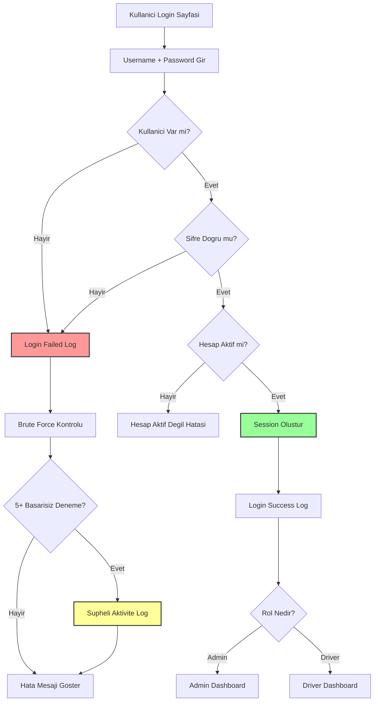
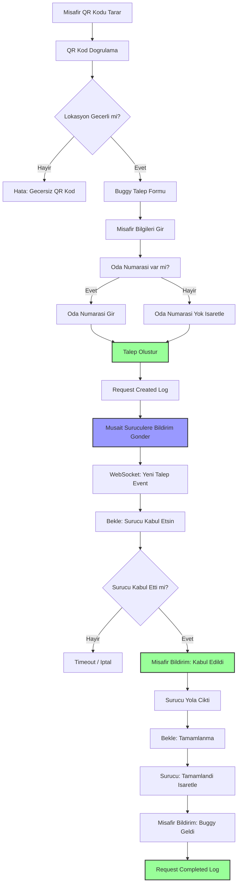
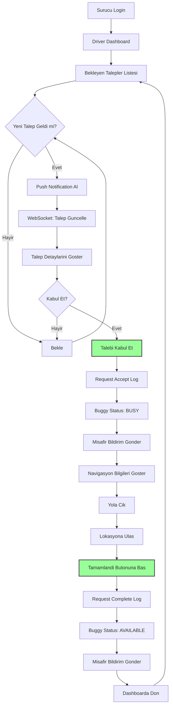
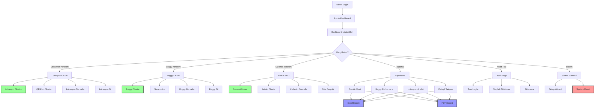
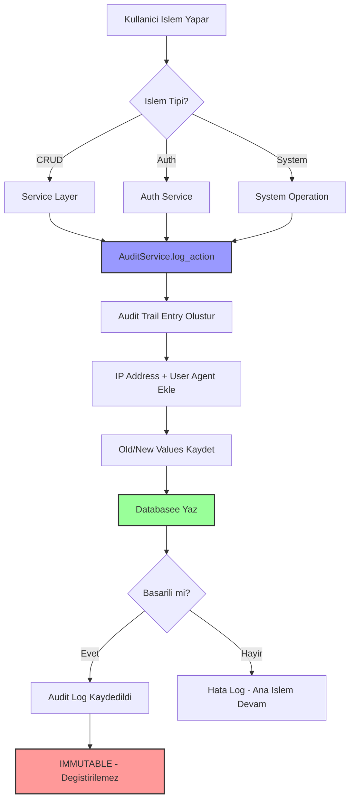

# 🚗 Buggy Call System - Detaylı Akış Şeması

## 📋 İçindekiler
1. [Sistem Mimarisi](#sistem-mimarisi)
2. [Kullanıcı Akışları](#kullanıcı-akışları)
3. [Veri Modeli](#veri-modeli)
4. [API Endpoint'leri](#api-endpointleri)
5. [Güvenlik Katmanları](#güvenlik-katmanları)
6. [Servis Katmanı](#servis-katmanı)
7. [WebSocket İletişimi](#websocket-iletişimi)
8. [Audit Trail Sistemi](#audit-trail-sistemi)

---

## 1. Sistem Mimarisi

### Genel Mimari
```
┌─────────────────────────────────────────────────────────────┐
│                     BUGGY CALL SYSTEM                        │
├─────────────────────────────────────────────────────────────┤
│                                                               │
│  ┌──────────────┐  ┌──────────────┐  ┌──────────────┐      │
│  │   Guest      │  │    Driver    │  │    Admin     │      │
│  │   (Misafir)  │  │   (Sürücü)   │  │  (Yönetici)  │      │
│  └──────┬───────┘  └──────┬───────┘  └──────┬───────┘      │
│         │                  │                  │               │
│         └──────────────────┴──────────────────┘               │
│                            │                                  │
│                            ▼                                  │
│         ┌──────────────────────────────────┐                 │
│         │      Flask Application           │                 │
│         │  (Routes + Middleware + Auth)    │                 │
│         └──────────────┬───────────────────┘                 │
│                        │                                      │
│         ┌──────────────┴───────────────┐                     │
│         │                                │                    │
│         ▼                                ▼                    │
│  ┌─────────────┐                 ┌─────────────┐            │
│  │   Service   │                 │  WebSocket  │            │
│  │    Layer    │                 │   (Socket   │            │
│  │             │                 │     IO)     │            │
│  └──────┬──────┘                 └─────────────┘            │
│         │                                                     │
│         ▼                                                     │
│  ┌─────────────┐                                            │
│  │   Models    │                                            │
│  │  (SQLAlch   │                                            │
│  │    emy)     │                                            │
│  └──────┬──────┘                                            │
│         │                                                     │
│         ▼                                                     │
│  ┌─────────────┐                                            │
│  │   MySQL     │                                            │
│  │  Database   │                                            │
│  └─────────────┘                                            │
│                                                               │
└─────────────────────────────────────────────────────────────┘
```


### Teknoloji Stack
```
┌─────────────────────────────────────────────────────────┐
│ Frontend Layer                                           │
├─────────────────────────────────────────────────────────┤
│ • HTML5 + Jinja2 Templates                              │
│ • JavaScript (Vanilla)                                   │
│ • CSS3 + Responsive Design                              │
│ • Service Worker (PWA)                                   │
│ • Socket.IO Client                                       │
└─────────────────────────────────────────────────────────┘

┌─────────────────────────────────────────────────────────┐
│ Backend Layer                                            │
├─────────────────────────────────────────────────────────┤
│ • Flask 3.0.0 (Web Framework)                           │
│ • Flask-SQLAlchemy (ORM)                                │
│ • Flask-Migrate (Database Migrations)                   │
│ • Flask-SocketIO (Real-time Communication)              │
│ • Flask-Limiter (Rate Limiting)                         │
│ • Flask-WTF (CSRF Protection)                           │
│ • Flask-CORS (Cross-Origin Resource Sharing)            │
│ • Marshmallow (Data Validation)                         │
│ • PyWebPush (Push Notifications)                        │
└─────────────────────────────────────────────────────────┘

┌─────────────────────────────────────────────────────────┐
│ Database Layer                                           │
├─────────────────────────────────────────────────────────┤
│ • MySQL 8.0+ (Primary Database)                         │
│ • SQLAlchemy ORM                                         │
│ • Alembic Migrations                                     │
└─────────────────────────────────────────────────────────┘

┌─────────────────────────────────────────────────────────┐
│ Security Layer                                           │
├─────────────────────────────────────────────────────────┤
│ • Bcrypt (Password Hashing)                             │
│ • Flask-WTF CSRF Protection                             │
│ • Rate Limiting (Flask-Limiter)                         │
│ • Session Management                                     │
│ • Audit Trail (Immutable Logs)                          │
│ • Suspicious Activity Detection                         │
└─────────────────────────────────────────────────────────┘
```

---

## 2. Kullanıcı Akışları

### 2.1 İlk Kurulum Akışı (Setup Wizard)

```mermaid
graph TD
    A[Sistem Ilk Kez Baslatiliyor] --> B{Setup Tamamlandi mi?}
    B -->|Hayir| C[/setup Sayfasina Yonlendir]
    B -->|Evet| D[Normal Akisa Devam]
    
    C --> E[Hotel Bilgilerini Gir]
    E --> F[Hotel Olustur]
    F --> G[Admin Hesabi Olustur]
    G --> H[Setup Tamamlandi Isaretle]
    H --> I[.setup_completed Dosyasi Olustur]
    I --> J[Login Sayfasina Yonlendir]
    
    style C fill:#f9f,stroke:#333,stroke-width:2px
    style H fill:#9f9,stroke:#333,stroke-width:2px
```

**Audit Trail Kayıtları:**
- `hotel_created` - Hotel oluşturuldu
- `admin_created_during_setup` - Admin hesabı oluşturuldu
- `system_setup_completed` - Kurulum tamamlandı


### 2.2 Kimlik Doğrulama Akışı (Authentication)



**Güvenlik Katmanları:**
1. **Rate Limiting:** 10 login denemesi / dakika
2. **Brute Force Detection:** 5 başarısız deneme / 5 dakika
3. **Audit Logging:** Tüm giriş denemeleri loglanır
4. **Session Management:** Güvenli session cookie'leri

**Audit Trail Kayıtları:**
- `login_success` - Başarılı giriş
- `login_failed` - Başarısız giriş
- `brute_force_attempt` - Brute force saldırısı tespit edildi
- `logout` - Çıkış yapıldı


### 2.3 Misafir Buggy Talep Akışı (Guest Request Flow)



**İş Akışı Adımları:**

1. **QR Kod Tarama**
   - Lokasyon ID'si QR koddan alınır
   - Lokasyon doğrulanır (aktif mi?)

2. **Talep Oluşturma**
   - Misafir bilgileri (isim, oda, telefon, notlar)
   - Status: `PENDING`
   - Timestamp: `requested_at`

3. **Bildirim Gönderme**
   - Tüm müsait sürücülere push notification
   - WebSocket event: `new_request`
   - Bulk notification log

4. **Sürücü Kabul**
   - Sürücü talebi kabul eder
   - Status: `PENDING` → `ACCEPTED`
   - Buggy status: `AVAILABLE` → `BUSY`
   - Timestamp: `accepted_at`
   - Response time hesaplanır

5. **Tamamlama**
   - Sürücü tamamlandı işaretler
   - Status: `ACCEPTED` → `COMPLETED`
   - Buggy status: `BUSY` → `AVAILABLE`
   - Timestamp: `completed_at`
   - Completion time hesaplanır

**Audit Trail Kayıtları:**
- `create` (request) - Talep oluşturuldu
- `update` (request) - Talep kabul edildi
- `update` (request) - Talep tamamlandı
- `bulk_push_notification_sent` - Toplu bildirim gönderildi


### 2.4 Sürücü Dashboard Akışı (Driver Flow)



**Sürücü Özellikleri:**
- Gerçek zamanlı talep bildirimleri
- Tek seferde bir talep kabul edebilir
- Buggy durumu otomatik güncellenir
- Performans metrikleri izlenir

**WebSocket Events:**
- `new_request` - Yeni talep geldi
- `request_accepted` - Talep kabul edildi
- `request_completed` - Talep tamamlandı
- `request_cancelled` - Talep iptal edildi


### 2.5 Admin Dashboard Akışı (Admin Flow)



**Admin Yetkileri:**
- Tüm CRUD işlemleri
- Rapor görüntüleme ve export
- Audit trail erişimi
- Sistem ayarları
- Kullanıcı yönetimi


---

## 3. Veri Modeli (Database Schema)

### Entity Relationship Diagram

```
┌─────────────────┐
│     Hotel       │
├─────────────────┤
│ id (PK)         │
│ name            │
│ code (UNIQUE)   │
│ address         │
│ phone           │
│ email           │
│ logo            │
│ timezone        │
│ created_at      │
│ updated_at      │
└────────┬────────┘
         │
         │ 1:N
         │
    ┌────┴────┬────────┬────────┬────────┐
    │         │        │        │        │
    ▼         ▼        ▼        ▼        ▼
┌────────┐ ┌────────┐ ┌────────┐ ┌────────┐ ┌────────┐
│SystemU │ │Location│ │ Buggy  │ │Request │ │ Audit  │
│  ser   │ │        │ │        │ │        │ │ Trail  │
└────────┘ └────────┘ └────────┘ └────────┘ └────────┘
```

### Detaylı Model İlişkileri

```
┌──────────────────────────────────────────────────────────────┐
│                        HOTEL                                  │
│  • 1 Hotel → N SystemUsers (admin, drivers)                 │
│  • 1 Hotel → N Locations                                     │
│  • 1 Hotel → N Buggies                                       │
│  • 1 Hotel → N BuggyRequests                                 │
│  • 1 Hotel → N AuditTrail                                    │
└──────────────────────────────────────────────────────────────┘

┌──────────────────────────────────────────────────────────────┐
│                     SYSTEM USER                               │
│  • Role: ADMIN | DRIVER                                      │
│  • 1 Driver → 1 Buggy (optional)                            │
│  • 1 Driver → N BuggyRequests (accepted_by)                 │
│  • 1 User → N Sessions                                       │
│  • 1 User → N AuditTrail                                     │
└──────────────────────────────────────────────────────────────┘

┌──────────────────────────────────────────────────────────────┐
│                      LOCATION                                 │
│  • Has QR Code (unique)                                      │
│  • 1 Location → N BuggyRequests                             │
│  • Coordinates (latitude, longitude)                         │
│  • Display order for sorting                                 │
└──────────────────────────────────────────────────────────────┘

┌──────────────────────────────────────────────────────────────┐
│                       BUGGY                                   │
│  • Status: AVAILABLE | BUSY | OFFLINE                       │
│  • 1 Buggy → 1 Driver (optional)                            │
│  • 1 Buggy → N BuggyRequests                                │
│  • Code (unique identifier)                                  │
└──────────────────────────────────────────────────────────────┘

┌──────────────────────────────────────────────────────────────┐
│                   BUGGY REQUEST                               │
│  • Status: PENDING | ACCEPTED | COMPLETED | CANCELLED       │
│  • Links: Hotel, Location, Buggy, Driver                    │
│  • Timestamps: requested_at, accepted_at, completed_at      │
│  • Metrics: response_time, completion_time                   │
│  • Guest info: name, room_number, phone, notes              │
│  • New fields: has_room, guest_device_id, cancelled_by      │
└──────────────────────────────────────────────────────────────┘

┌──────────────────────────────────────────────────────────────┐
│                    AUDIT TRAIL                                │
│  • IMMUTABLE (cannot be modified or deleted)                │
│  • Tracks all system actions                                 │
│  • Fields: action, entity_type, entity_id                   │
│  • Old/New values (JSON)                                     │
│  • IP address, User agent                                    │
└──────────────────────────────────────────────────────────────┘

┌──────────────────────────────────────────────────────────────┐
│                      SESSION                                  │
│  • User sessions for security                                │
│  • Fields: session_token, ip_address, user_agent           │
│  • New fields: is_active, last_activity, revoked_at        │
│  • Expires_at for automatic cleanup                          │
└──────────────────────────────────────────────────────────────┘
```


---

## 4. API Endpoint'leri

### 4.1 Authentication Endpoints

```
POST   /auth/login              → Kullanıcı girişi
POST   /auth/logout             → Kullanıcı çıkışı
POST   /auth/change-password    → Şifre değiştirme
GET    /auth/check-session      → Session kontrolü
```

### 4.2 Guest Endpoints

```
GET    /guest/call              → Buggy talep formu (QR kod ile)
POST   /api/guest/request       → Yeni talep oluştur
GET    /api/guest/request/:id   → Talep durumu sorgula
```

### 4.3 Driver Endpoints

```
GET    /driver/dashboard        → Sürücü dashboard
GET    /api/driver/requests     → Bekleyen talepler
POST   /api/driver/accept/:id   → Talebi kabul et
POST   /api/driver/complete/:id → Talebi tamamla
GET    /api/driver/history      → Geçmiş talepler
```

### 4.4 Admin Endpoints

```
GET    /admin/dashboard         → Admin dashboard
GET    /admin/locations         → Lokasyon yönetimi
GET    /admin/buggies           → Buggy yönetimi
GET    /admin/users             → Kullanıcı yönetimi
```

### 4.5 Location API

```
GET    /api/locations           → Lokasyon listesi
POST   /api/locations           → Lokasyon oluştur
GET    /api/locations/:id       → Lokasyon detay
PUT    /api/locations/:id       → Lokasyon güncelle
DELETE /api/locations/:id       → Lokasyon sil
POST   /api/locations/:id/qr    → QR kod yenile
```

### 4.6 Buggy API

```
GET    /api/buggies             → Buggy listesi
POST   /api/buggies             → Buggy oluştur
GET    /api/buggies/:id         → Buggy detay
PUT    /api/buggies/:id         → Buggy güncelle
DELETE /api/buggies/:id         → Buggy sil
PATCH  /api/buggies/:id/status  → Buggy durumu değiştir
```

### 4.7 Request API

```
GET    /api/requests            → Talep listesi
POST   /api/requests            → Talep oluştur
GET    /api/requests/:id        → Talep detay
PUT    /api/requests/:id        → Talep güncelle
POST   /api/requests/:id/accept → Talebi kabul et
POST   /api/requests/:id/complete → Talebi tamamla
POST   /api/requests/:id/cancel → Talebi iptal et
```

### 4.8 Report API

```
GET    /api/reports/daily-summary       → Günlük özet
GET    /api/reports/buggy-performance   → Buggy performans
GET    /api/reports/location-analytics  → Lokasyon analizi
GET    /api/reports/request-details     → Detaylı talepler
GET    /api/reports/dashboard-stats     → Dashboard istatistikleri

GET    /api/reports/export/excel/:type  → Excel export
GET    /api/reports/export/pdf/:type    → PDF export
```

### 4.9 Audit API

```
GET    /api/audit                       → Audit log listesi
GET    /api/audit/stats                 → Audit istatistikleri
GET    /api/audit/suspicious-activity   → Şüpheli aktiviteler
DELETE /api/audit/:id                   → Silme denemesi (DENIED)
PUT    /api/audit/:id                   → Güncelleme denemesi (DENIED)
```

### 4.10 Push Notification API

```
GET    /api/push/vapid-public-key       → VAPID public key
POST   /api/push/subscribe              → Bildirim aboneliği
POST   /api/push/unsubscribe            → Abonelik iptali
POST   /api/push/test                   → Test bildirimi
```

### 4.11 Setup & System API

```
GET    /setup                           → Setup wizard sayfası
GET    /api/setup/check                 → Setup durumu
POST   /api/setup/hotel                 → Hotel oluştur
POST   /api/setup/admin                 → Admin oluştur
POST   /api/setup/complete              → Setup tamamla
POST   /api/setup/reset                 → Setup sıfırla (dev only)

GET    /buggysystemreset                → System reset sayfası
POST   /api/system-reset/check          → Reset şifresi kontrol
POST   /api/system-reset/execute        → System reset çalıştır
```

### 4.12 Health & Monitoring

```
GET    /health                          → Health check
GET    /health/db                       → Database health
GET    /health/detailed                 → Detaylı health
```


---

## 5. Güvenlik Katmanları

### 5.1 Güvenlik Mimarisi

```
┌─────────────────────────────────────────────────────────────┐
│                    REQUEST FLOW                              │
└─────────────────────────────────────────────────────────────┘
                            │
                            ▼
┌─────────────────────────────────────────────────────────────┐
│  Layer 1: Rate Limiting (Flask-Limiter)                     │
│  • 100 requests / hour (default)                            │
│  • 10 login attempts / minute                               │
│  • 5 system-reset attempts / minute                         │
└─────────────────────────────────────────────────────────────┘
                            │
                            ▼
┌─────────────────────────────────────────────────────────────┐
│  Layer 2: Suspicious Activity Detection                     │
│  • Brute force detection (5 failed logins)                  │
│  • DDoS detection (100 requests / 5 min)                    │
│  • Bulk operation detection (50+ items)                     │
│  • Unauthorized access attempts                             │
└─────────────────────────────────────────────────────────────┘
                            │
                            ▼
┌─────────────────────────────────────────────────────────────┐
│  Layer 3: Setup Check Middleware                            │
│  • Redirects to /setup if not completed                     │
│  • Exempts: /setup, /static, /buggysystemreset             │
└─────────────────────────────────────────────────────────────┘
                            │
                            ▼
┌─────────────────────────────────────────────────────────────┐
│  Layer 4: CSRF Protection (Flask-WTF)                       │
│  • Token validation for POST/PUT/PATCH/DELETE               │
│  • Exempted: API endpoints (use session auth)              │
└─────────────────────────────────────────────────────────────┘
                            │
                            ▼
┌─────────────────────────────────────────────────────────────┐
│  Layer 5: Authentication & Authorization                    │
│  • Session-based authentication                             │
│  • Role-based access control (Admin/Driver)                 │
│  • @require_login decorator                                 │
│  • @require_role decorator                                  │
└─────────────────────────────────────────────────────────────┘
                            │
                            ▼
┌─────────────────────────────────────────────────────────────┐
│  Layer 6: Input Validation (Marshmallow)                    │
│  • Schema validation for all inputs                         │
│  • Type checking                                             │
│  • Required field validation                                │
└─────────────────────────────────────────────────────────────┘
                            │
                            ▼
┌─────────────────────────────────────────────────────────────┐
│  Layer 7: Audit Trail (Immutable Logging)                   │
│  • All actions logged                                        │
│  • Cannot be modified or deleted                            │
│  • Suspicious activity tracking                             │
└─────────────────────────────────────────────────────────────┘
                            │
                            ▼
                    [Business Logic]
```

### 5.2 Şüpheli Aktivite Tespiti

```
┌─────────────────────────────────────────────────────────────┐
│           SUSPICIOUS ACTIVITY DETECTION                      │
├─────────────────────────────────────────────────────────────┤
│                                                               │
│  1. Brute Force Attack Detection                            │
│     ├─ Threshold: 5 failed logins / 5 minutes              │
│     ├─ Tracking: Username + IP address                      │
│     └─ Action: Log as 'brute_force_attempt'                │
│                                                               │
│  2. DDoS Attack Detection                                    │
│     ├─ Threshold: 100 requests / 5 minutes                  │
│     ├─ Tracking: User ID or IP address                      │
│     └─ Action: Log as 'rapid_requests_detected'            │
│                                                               │
│  3. Bulk Operation Detection                                 │
│     ├─ Threshold: 50+ items in single request              │
│     ├─ Tracking: POST/PUT/DELETE requests                   │
│     └─ Action: Log as 'suspicious_bulk_operation'          │
│                                                               │
│  4. Unauthorized Access Attempts                             │
│     ├─ Detection: Role mismatch on protected endpoints      │
│     ├─ Tracking: User ID + Endpoint + Required role        │
│     └─ Action: Log as 'unauthorized_access_attempt'        │
│                                                               │
│  5. Audit Log Tampering Attempts                            │
│     ├─ Detection: DELETE/PUT/PATCH on /api/audit/:id       │
│     ├─ Always denied (403 Forbidden)                        │
│     └─ Action: Log as 'audit_deletion_attempt' or          │
│                'audit_modification_attempt'                  │
│                                                               │
└─────────────────────────────────────────────────────────────┘
```


---

## 6. Servis Katmanı (Service Layer)

### 6.1 Servis Mimarisi

```
┌─────────────────────────────────────────────────────────────┐
│                    ROUTES LAYER                              │
│  (HTTP Request Handling, Validation, Response)              │
└────────────────────┬────────────────────────────────────────┘
                     │
                     ▼
┌─────────────────────────────────────────────────────────────┐
│                   SERVICE LAYER                              │
│  (Business Logic, Orchestration, Transactions)              │
├─────────────────────────────────────────────────────────────┤
│                                                               │
│  ┌──────────────┐  ┌──────────────┐  ┌──────────────┐      │
│  │ AuthService  │  │LocationServ  │  │ BuggyService │      │
│  │              │  │    ice       │  │              │      │
│  └──────────────┘  └──────────────┘  └──────────────┘      │
│                                                               │
│  ┌──────────────┐  ┌──────────────┐  ┌──────────────┐      │
│  │RequestServ   │  │Notification  │  │ AuditService │      │
│  │   ice        │  │   Service    │  │              │      │
│  └──────────────┘  └──────────────┘  └──────────────┘      │
│                                                               │
│  ┌──────────────┐  ┌──────────────┐                         │
│  │ QRService    │  │ReportService │                         │
│  │              │  │              │                         │
│  └──────────────┘  └──────────────┘                         │
│                                                               │
└────────────────────┬────────────────────────────────────────┘
                     │
                     ▼
┌─────────────────────────────────────────────────────────────┐
│                    MODELS LAYER                              │
│  (Database Access, ORM, Relationships)                      │
└─────────────────────────────────────────────────────────────┘
```

### 6.2 Servis Detayları

#### AuthService
```python
• login(username, password)
  ├─ User validation
  ├─ Password check (bcrypt)
  ├─ Session creation
  ├─ Audit logging (login_success/failed)
  └─ Brute force tracking

• logout(user_id, hotel_id)
  ├─ Session cleanup
  └─ Audit logging (logout)

• change_password(user_id, old_password, new_password)
  ├─ Password validation
  ├─ Password update
  └─ Audit logging (password_changed)

• create_user(data)
  ├─ User creation
  ├─ Password hashing
  └─ Audit logging (create)
```

#### LocationService
```python
• create_location(data)
  ├─ Location creation
  ├─ QR code generation
  └─ Audit logging (create)

• update_location(location_id, data)
  ├─ Location update
  └─ Audit logging (update)

• delete_location(location_id)
  ├─ Location deletion
  └─ Audit logging (delete)

• regenerate_qr_code(location_id)
  ├─ New QR code generation
  └─ Audit logging (qr_code_regenerated)
```

#### BuggyService
```python
• create_buggy(data)
  ├─ Buggy creation
  └─ Audit logging (create)

• update_buggy(buggy_id, data)
  ├─ Buggy update
  └─ Audit logging (update)

• change_status(buggy_id, new_status)
  ├─ Status update
  └─ Audit logging (status_changed)

• delete_buggy(buggy_id)
  ├─ Buggy deletion
  └─ Audit logging (delete)
```

#### RequestService
```python
• create_request(data)
  ├─ Request creation
  ├─ Notification to drivers
  ├─ WebSocket event
  └─ Audit logging (create)

• accept_request(request_id, driver_id, buggy_id)
  ├─ Request acceptance
  ├─ Buggy status update (BUSY)
  ├─ Response time calculation
  ├─ Notification to guest
  ├─ WebSocket event
  └─ Audit logging (update)

• complete_request(request_id)
  ├─ Request completion
  ├─ Buggy status update (AVAILABLE)
  ├─ Completion time calculation
  ├─ Notification to guest
  ├─ WebSocket event
  └─ Audit logging (update)

• cancel_request(request_id, cancelled_by)
  ├─ Request cancellation
  ├─ Buggy status update (if accepted)
  ├─ WebSocket event
  └─ Audit logging (update)
```

#### NotificationService
```python
• send_notification(subscription_info, title, body, data)
  ├─ Push notification via WebPush
  └─ Error handling

• notify_new_request(request_obj)
  ├─ Get available drivers
  ├─ Send bulk notifications
  └─ Audit logging (bulk_push_notification_sent)

• notify_request_accepted(request_obj)
  └─ Send notification to guest

• notify_request_completed(request_obj)
  └─ Send notification to guest

• generate_vapid_keys()
  └─ VAPID key generation
```

#### AuditService
```python
• log_action(action, entity_type, entity_id, old_values, new_values)
  ├─ Create audit trail entry
  ├─ IP address tracking
  └─ User agent tracking

• log_create(entity_type, entity_id, new_values)
• log_update(entity_type, entity_id, old_values, new_values)
• log_delete(entity_type, entity_id, old_values)
• log_login(user_id, hotel_id, success)
• log_logout(user_id, hotel_id)

• get_audit_trail(hotel_id, filters, page, per_page)
  ├─ Filtering
  ├─ Pagination
  └─ Return audit logs
```

#### ReportService
```python
• get_daily_summary(hotel_id, date)
  └─ Daily statistics

• get_buggy_performance(hotel_id, buggy_id, start_date, end_date)
  └─ Buggy performance metrics

• get_location_analytics(hotel_id, start_date, end_date)
  └─ Location usage statistics

• get_request_details(hotel_id, status, start_date, end_date, limit)
  └─ Detailed request list

• export_to_excel(data, filename, sheet_name)
  ├─ Excel generation (openpyxl)
  └─ Audit logging (report_exported)

• export_to_pdf(data, title, filename)
  ├─ PDF generation (reportlab)
  └─ Audit logging (report_exported)
```


---

## 7. WebSocket İletişimi (Real-time Communication)

### 7.1 WebSocket Mimarisi

```
┌─────────────────────────────────────────────────────────────┐
│                  CLIENT (Browser)                            │
│  • Socket.IO Client Library                                 │
│  • Event Listeners                                           │
└────────────────────┬────────────────────────────────────────┘
                     │
                     │ WebSocket Connection
                     │
                     ▼
┌─────────────────────────────────────────────────────────────┐
│              FLASK-SOCKETIO SERVER                           │
│  • Event Handlers                                            │
│  • Room Management                                           │
│  • Broadcast Messages                                        │
└────────────────────┬────────────────────────────────────────┘
                     │
                     ▼
┌─────────────────────────────────────────────────────────────┐
│                  BUSINESS LOGIC                              │
│  • Request Service                                           │
│  • Notification Service                                      │
└─────────────────────────────────────────────────────────────┘
```

### 7.2 WebSocket Events

#### Client → Server Events

```javascript
// Connection
socket.on('connect', () => {
    console.log('Connected to server');
});

// Join room (hotel-specific)
socket.emit('join', {
    hotel_id: 1,
    user_id: 123,
    role: 'driver'
});

// Driver accepts request
socket.emit('accept_request', {
    request_id: 456,
    driver_id: 123,
    buggy_id: 789
});

// Driver completes request
socket.emit('complete_request', {
    request_id: 456
});
```

#### Server → Client Events

```javascript
// New request notification (to drivers)
socket.on('new_request', (data) => {
    // data: { request_id, location, room_number, guest_name }
    showNotification('Yeni Talep!', data);
});

// Request accepted (to guest)
socket.on('request_accepted', (data) => {
    // data: { request_id, driver_name, buggy_code, eta }
    updateRequestStatus('accepted', data);
});

// Request completed (to guest)
socket.on('request_completed', (data) => {
    // data: { request_id }
    updateRequestStatus('completed', data);
});

// Request cancelled
socket.on('request_cancelled', (data) => {
    // data: { request_id, reason }
    updateRequestStatus('cancelled', data);
});

// Buggy status changed
socket.on('buggy_status_changed', (data) => {
    // data: { buggy_id, old_status, new_status }
    updateBuggyStatus(data);
});
```

### 7.3 Room Management

```
┌─────────────────────────────────────────────────────────────┐
│                    SOCKET.IO ROOMS                           │
├─────────────────────────────────────────────────────────────┤
│                                                               │
│  hotel_1_drivers     → All drivers in Hotel 1              │
│  hotel_1_admins      → All admins in Hotel 1               │
│  hotel_2_drivers     → All drivers in Hotel 2              │
│  hotel_2_admins      → All admins in Hotel 2               │
│  request_456         → Specific request participants        │
│                                                               │
└─────────────────────────────────────────────────────────────┘
```

**Room Kullanımı:**
- Yeni talep → `hotel_{id}_drivers` room'una broadcast
- Talep kabul → `request_{id}` room'una broadcast
- Talep tamamlama → `request_{id}` room'una broadcast
- Buggy durum değişikliği → `hotel_{id}_admins` room'una broadcast


---

## 8. Audit Trail Sistemi

### 8.1 Audit Trail Akışı



### 8.2 Loglanan İşlemler

#### Kimlik Doğrulama
- `login_success` - Başarılı giriş
- `login_failed` - Başarısız giriş
- `logout` - Çıkış
- `password_changed` - Şifre değişikliği
- `brute_force_attempt` - Brute force saldırısı

#### CRUD İşlemleri
- `create` - Oluşturma (location, buggy, user, request)
- `update` - Güncelleme (location, buggy, user, request)
- `delete` - Silme (location, buggy, user)
- `status_changed` - Durum değişikliği (buggy)
- `qr_code_regenerated` - QR kod yenileme

#### Bildirim İşlemleri
- `push_notification_subscribed` - Abonelik
- `push_notification_unsubscribed` - Abonelik iptali
- `bulk_push_notification_sent` - Toplu bildirim

#### Rapor İşlemleri
- `report_exported` - Rapor export (Excel/PDF)

#### Sistem İşlemleri
- `hotel_created` - Hotel oluşturuldu
- `admin_created_during_setup` - Admin oluşturuldu
- `system_setup_completed` - Kurulum tamamlandı
- `system_reset_password_failed` - Reset şifresi hatalı
- `system_reset_password_verified` - Reset şifresi doğru
- `system_reset_executed` - System reset çalıştırıldı

#### Güvenlik İşlemleri
- `audit_deletion_attempt` - Audit log silme denemesi
- `audit_modification_attempt` - Audit log değiştirme denemesi
- `rapid_requests_detected` - Hızlı istek saldırısı
- `suspicious_bulk_operation` - Şüpheli toplu işlem
- `unauthorized_access_attempt` - Yetkisiz erişim denemesi

### 8.3 Audit Log Koruma

```
┌─────────────────────────────────────────────────────────────┐
│              AUDIT LOG IMMUTABILITY                          │
├─────────────────────────────────────────────────────────────┤
│                                                               │
│  1. Model Level Protection                                   │
│     ├─ __setattr__ override                                 │
│     ├─ __delattr__ override                                 │
│     └─ Raises AttributeError on modification                │
│                                                               │
│  2. API Level Protection                                     │
│     ├─ DELETE /api/audit/:id  → 403 Forbidden              │
│     ├─ PUT /api/audit/:id     → 403 Forbidden              │
│     ├─ PATCH /api/audit/:id   → 403 Forbidden              │
│     └─ All attempts logged as suspicious activity           │
│                                                               │
│  3. Database Level (Recommended)                             │
│     ├─ MySQL Trigger: BEFORE UPDATE → SIGNAL error         │
│     ├─ MySQL Trigger: BEFORE DELETE → SIGNAL error         │
│     └─ Additional layer of protection                        │
│                                                               │
└─────────────────────────────────────────────────────────────┘
```


---

## 9. Sistem Reset Akışı (Emergency Reset)

```mermaid
graph TD
    A[/buggysystemreset Sayfasi] --> B[Sifre Gir: 518518Erkan]
    B --> C{Sifre Dogru mu?}
    
    C -->|Hayir| D[Hata Mesaji]
    D --> E[Audit: system_reset_password_failed]
    E --> B
    
    C -->|Evet| F[Verileri Kontrol Et]
    F --> G[Istatistikleri Goster]
    G --> H[Audit: system_reset_password_verified]
    
    H --> I[Kullanici Onay: Sil Butonu]
    I --> J{Onay Verildi mi?}
    
    J -->|Hayir| K[Iptal]
    J -->|Evet| L[Ikinci Onay Sor]
    
    L --> M{Ikinci Onay?}
    M -->|Hayir| K
    M -->|Evet| N[Audit: system_reset_executed]
    
    N --> O[TUM VERILERI SIL]
    O --> P[Sessions Sil]
    P --> Q[AuditTrail Sil]
    Q --> R[BuggyRequests Sil]
    R --> S[Buggies Sil]
    S --> T[Locations Sil]
    T --> U[SystemUsers Sil]
    U --> V[Hotels Sil]
    
    V --> W[.setup_completed Dosyasini Sil]
    W --> X[/setup Sayfasina Yonlendir]
    
    style N fill:#f99,stroke:#333,stroke-width:2px
    style O fill:#f00,stroke:#333,stroke-width:4px,color:#fff
    style X fill:#9f9,stroke:#333,stroke-width:2px
```

**Güvenlik Önlemleri:**
1. Gizli URL: `/buggysystemreset`
2. Güçlü şifre: `518518Erkan`
3. Çift onay mekanizması
4. Tüm işlemler audit trail'e kaydedilir
5. Silme öncesi veri istatistikleri gösterilir

---

## 10. Deployment & Scaling

### 10.1 Deployment Mimarisi

```
┌─────────────────────────────────────────────────────────────┐
│                    PRODUCTION SETUP                          │
├─────────────────────────────────────────────────────────────┤
│                                                               │
│  ┌──────────────┐                                            │
│  │   Nginx      │  (Reverse Proxy + Static Files)           │
│  │   :80/443    │                                            │
│  └──────┬───────┘                                            │
│         │                                                     │
│         ▼                                                     │
│  ┌──────────────┐                                            │
│  │  Gunicorn    │  (WSGI Server)                            │
│  │  :5000       │  • Multiple workers                        │
│  └──────┬───────┘  • Eventlet for WebSocket                 │
│         │                                                     │
│         ▼                                                     │
│  ┌──────────────┐                                            │
│  │ Flask App    │  (Application)                            │
│  │              │                                            │
│  └──────┬───────┘                                            │
│         │                                                     │
│         ▼                                                     │
│  ┌──────────────┐                                            │
│  │   MySQL      │  (Database)                               │
│  │   :3306      │                                            │
│  └──────────────┘                                            │
│                                                               │
└─────────────────────────────────────────────────────────────┘
```

### 10.2 Scaling Considerations

**Horizontal Scaling:**
- Multiple Gunicorn workers
- Load balancer (Nginx)
- Redis for session storage (optional)
- Redis for SocketIO message queue (for multi-instance)

**Vertical Scaling:**
- Increase worker count
- Increase database connections
- Optimize queries

**Database Optimization:**
- Indexes on frequently queried fields
- Connection pooling
- Query optimization
- Regular maintenance

---

## 11. Monitoring & Logging

### 11.1 Logging Katmanları

```
┌─────────────────────────────────────────────────────────────┐
│                    LOGGING SYSTEM                            │
├─────────────────────────────────────────────────────────────┤
│                                                               │
│  Application Logs                                            │
│  ├─ logs/buggycall.log                                      │
│  ├─ Rotating file handler (10MB, 5 backups)                │
│  └─ Levels: DEBUG, INFO, WARNING, ERROR, CRITICAL          │
│                                                               │
│  Audit Trail                                                 │
│  ├─ Database: audit_trail table                             │
│  ├─ Immutable logs                                           │
│  └─ All user actions                                         │
│                                                               │
│  Suspicious Activity                                         │
│  ├─ Database: audit_trail table                             │
│  ├─ Special actions: brute_force, rapid_requests, etc.     │
│  └─ Real-time detection                                      │
│                                                               │
│  Health Checks                                               │
│  ├─ /health endpoint                                         │
│  ├─ Database connectivity                                    │
│  └─ System status                                            │
│                                                               │
└─────────────────────────────────────────────────────────────┘
```

---

## 12. Özet: Sistem Akış Haritası

```
START
  │
  ├─→ Setup Check
  │   ├─ Not completed → /setup
  │   └─ Completed → Continue
  │
  ├─→ Authentication
  │   ├─ Login → Session
  │   ├─ Rate Limiting
  │   ├─ Brute Force Detection
  │   └─ Audit Logging
  │
  ├─→ Authorization
  │   ├─ Role Check (Admin/Driver)
  │   ├─ Permission Check
  │   └─ Unauthorized → 403
  │
  ├─→ Request Processing
  │   ├─ CSRF Validation
  │   ├─ Input Validation (Marshmallow)
  │   ├─ Service Layer
  │   ├─ Database Operations
  │   ├─ Audit Logging
  │   └─ Response
  │
  ├─→ Real-time Communication
  │   ├─ WebSocket Connection
  │   ├─ Room Management
  │   ├─ Event Broadcasting
  │   └─ Push Notifications
  │
  ├─→ Monitoring
  │   ├─ Application Logs
  │   ├─ Audit Trail
  │   ├─ Suspicious Activity
  │   └─ Health Checks
  │
  └─→ END
```

---

## 🎯 Sonuç

Bu sistem:
- ✅ Güvenli (7 katmanlı güvenlik)
- ✅ Ölçeklenebilir (Service layer + WebSocket)
- ✅ İzlenebilir (Audit trail + Logging)
- ✅ Gerçek zamanlı (WebSocket + Push notifications)
- ✅ Modüler (Service-based architecture)
- ✅ Bakımı kolay (Clean code + Documentation)

**Toplam Endpoint:** 50+  
**Toplam Model:** 7  
**Toplam Servis:** 8  
**Güvenlik Katmanı:** 7  
**Audit Action:** 30+

