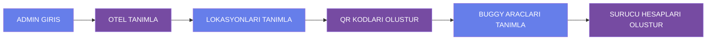
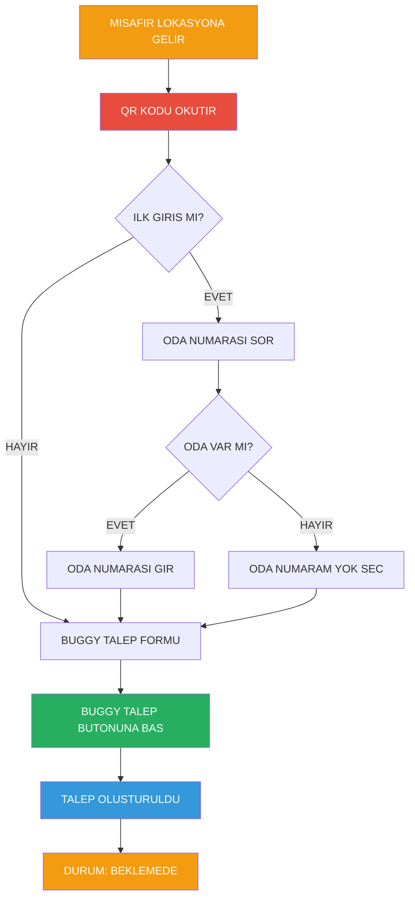
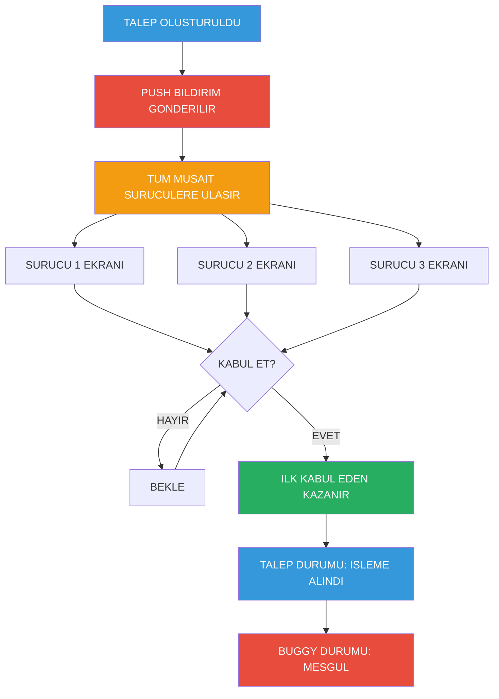
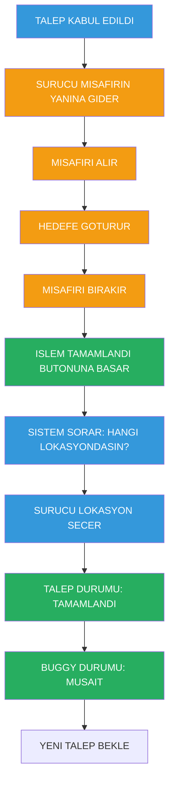
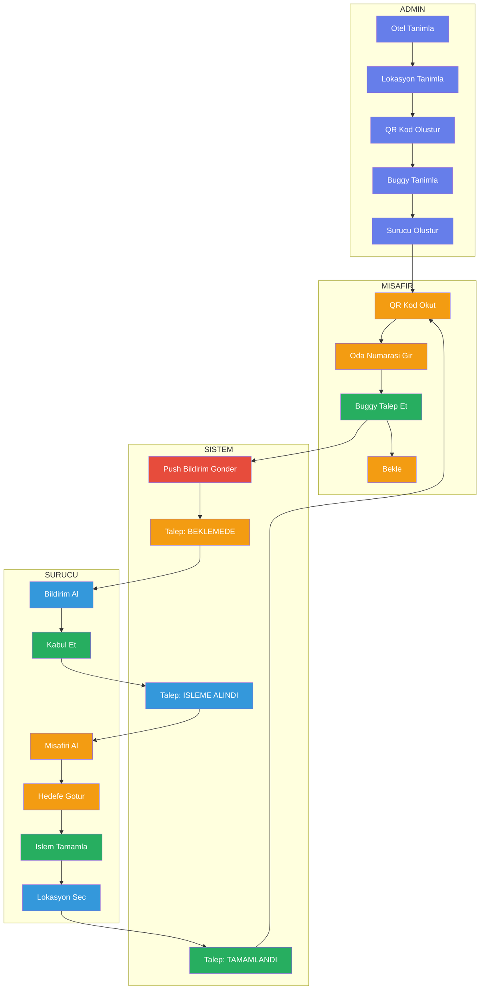

# 🚗 Buggy Call - Akış Diyagramı

## 📋 Sistem Kullanım Akışı

---

## 1️⃣ ADMIN KURULUM AŞAMASI



### Admin Yapılanlar:
1. **Otel Tanımlama** → Otel bilgileri sisteme girilir
2. **Lokasyon Tanımlama** → Buggy çağrı noktaları oluşturulur (Havuz, Plaj, Restoran, vb.)
3. **QR Kod Oluşturma** → Her lokasyon için benzersiz QR kod üretilir
4. **QR Kodları Yerleştirme** → QR kodlar lokasyonlara asılır/yapıştırılır
5. **Buggy Tanımlama** → Araç bilgileri sisteme girilir (Plaka, Model, vb.)
6. **Sürücü Hesapları** → Her sürücü için kullanıcı adı ve şifre oluşturulur

---

## 2️⃣ MISAFIR BUGGY TALEP AKIŞI



### Misafir Adımları:
1. **Lokasyona Gelir** → Buggy çağrı noktasına varır
2. **QR Kod Okutma** → Telefon ile QR kodu tarar
3. **İlk Giriş Kontrolü** → Sistem oda numarası sorar
   - Oda varsa → Oda numarasını girer
   - Oda yoksa → "Oda Numaram Yok" seçeneğini işaretler
4. **Buggy Talep** → "Buggy Talep Et" butonuna basar
5. **Bekleme** → Talep "Beklemede" durumuna geçer

---

## 3️⃣ SURUCU BILDIRIM VE KABUL AKIŞI



### Sürücü Bildirimi:
1. **Push Notification** → Tüm müsait sürücülere bildirim gider
2. **Talep Listesi** → Sürücü ekranında "Beklemede" olarak görünür
3. **Kabul Etme** → İlk "Kabul Et" butonuna basan sürücü talebi alır
4. **Durum Değişimi** → 
   - Talep: "Beklemede" → "İşleme Alındı"
   - Buggy: "Müsait" → "Meşgul"

---

## 4️⃣ SURUCU HIZMET AKIŞI



### Hizmet Süreci:
1. **Misafirin Yanına Git** → Sürücü talep lokasyonuna gider
2. **Misafiri Al** → Misafir buggy'ye biner
3. **Hedefe Götür** → İstenen yere ulaştırır
4. **Misafiri Bırak** → Misafir iner
5. **İşlem Tamamla** → "İşlem Tamamlandı" butonuna basar
6. **Lokasyon Seç** → Sistem sorar: "Hangi lokasyondasın?"
7. **Lokasyon Belirt** → Önceden tanımlı lokasyonlardan birini seçer
8. **Durum Güncelleme** →
   - Talep: "İşleme Alındı" → "Tamamlandı"
   - Buggy: "Meşgul" → "Müsait"
9. **Yeni Talep Bekle** → Sistem yeni taleplere hazır

---

## 🔄 TAM SISTEM AKIŞI (ÖZET)



---

## 📊 DURUM GEÇIŞLERI

### Talep Durumları:
```
BEKLEMEDE → ISLEME ALINDI → TAMAMLANDI
   ↓              ↓              ↓
 (Yeni)      (Kabul Edildi)  (Bitti)
```

### Buggy Durumları:
```
MUSAIT → MESGUL → MUSAIT
  ↓         ↓         ↓
(Bos)   (Calisiyor) (Bos)
```

---

## 🎯 ÖZET AKIŞ

1. **ADMIN** → Sistemi kurar (Otel, Lokasyon, QR, Buggy, Sürücü)
2. **MISAFIR** → QR okutup buggy talep eder
3. **SISTEM** → Tüm müsait sürücülere bildirim gönderir
4. **SÜRÜCÜ** → Talebi kabul edip hizmeti tamamlar
5. **DÖNGÜ** → Sistem yeni taleplere hazır

---

## 🔑 ÖNEMLİ NOKTALAR

✅ **QR Kod** → Her lokasyon için benzersiz  
✅ **Oda Numarası** → Opsiyonel (Oda numaram yok seçeneği var)  
✅ **Push Bildirim** → Sadece müsait sürücülere gider  
✅ **İlk Kabul Eden** → Talebi alan sürücü olur  
✅ **Otomatik Durum** → Buggy durumu otomatik güncellenir  
✅ **Lokasyon Seçimi** → İşlem sonunda sürücü konumunu belirtir  

